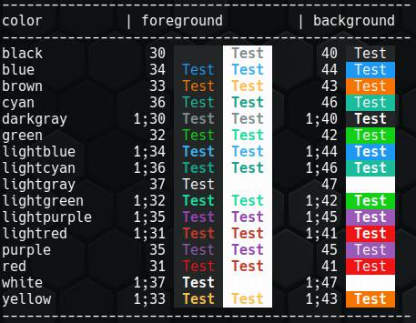

# Bash: color functions

Free software and Open source.

👤 Author: Axel Hahn \
📄 Source: <https://github.com/axelhahn/bash_colorfunctions> \
📜 License: GNU GPL 3.0 \
📗 Docs: see <https://www.axel-hahn.de/docs/bash_colorfunctions>

---


You get class like funtions to set foreground and backround colors easily in your bash scripts. 

## Quick tutorial

Source this script:

```txt
. ./src/color.class.sh
```

and execute `color.help` or read the docs :-)

### Example 1

Set a color. Every following command uses that color until you set a new one or reset it.

```shell
color.fg "blue"
ls -l
color.reset
```

### Example 2

Echo a single message in green and reset the color afterwards.

```shell
color.echo "green" "OK. I guess you got it."
```

### Colors

To set a color you can use ansi code, color names (see table below) or rgb heccodes (like css color codes).


