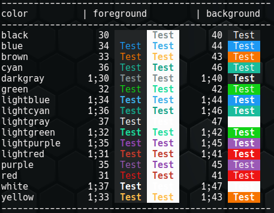

## Colors

### List

To see the colors, names or ansi code you can call `color.list`

### Colors

When using colors there are multiple ways.

* **ansi values** - if you are familiar with the ansi color codes already you can set white as "1;47" or cyan as "36" 
Set cyan foreground: `color.fg "36"`  
Set white background: `color.bg "1;47"` 
 
* **Basic colors (0..7)**  - this can set only the foreground colors 30 to 37 and background colors 40 to 47. Do not to care about the different ranges for foreground and background - the prefix '3' (foreground) or '4' (background) will be set internally  by the used function.
  * 0 - black
  * 1 - red
  * 2 - green
  * 3 - brown
  * 4 - blue
  * 5 - purple
  * 6 - cyan
  * 7 - gray 
Set cyan foreground: `color.fg "6"` 
Set gray background: `color.bg "7"` 
 
* **color names** - The color names are not standard. But they are simpler to handle than fiddly ansi color values. 
  * black
  * blue
  * brown
  * cyan
  * darkgray
  * green
  * lightblue
  * lightcyan
  * lightgray
  * lightgreen
  * lightpurple
  * lightred
  * purple
  * red
  * white
  * yellow
Set cyan foreground: `color.fg "cyan"`  
Set white background: `color.bg "white"`
 
* **RGB hex code** (1) - if you are familiar with css color hexcodes you maybe like this syntax.
  * use a `#` as prefix
  * followed by 2 digits for the colors red, green and blue
Set a blue background: `color.bg "#10404f"`

(1) WIP: At the moment you can set only foreground OR background with a rgb color code. When applying a rgb color for foreground it resets the color for background. If yoz set a rgb value for background it resets the color of foreground. If you are an ansi color guru you can help me to fix it.
