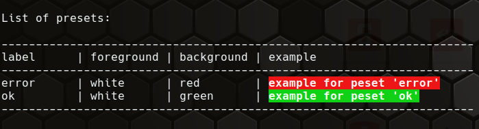

## Color presets

### Define presets

A color preset is a shortcut with a wanted label for a combination of foreground and background color.

A preset label is part of a variable behind a prefix `COLOR_PRESET_`.
The color values are written as array where the foreground is the 1st parameter and the optional background must be the 2nd.

In your script define add one variable per preset like that:

**Syntax**:

```txt
COLOR_PRESET_<LABEL>=(<FOREGROUND> <BACKGROUND>)
```

* LABEL - Don't set a label of an existing color like listed in 'color.list' - use describing strings.
* FOREGROUND, BACKGROUND are color values. See the menu item -> [Colors](50_Colors.md). 

Before the colorset of a preset is activated the colors will be reseted. An empty value for foreground or background will use the default colors.

**Example**:

```shell
# custom presets as array of foreground and background color
#
#            +--- the label is part of the variable
#            |
#            v
COLOR_PRESET_error=("white" "red")
COLOR_PRESET_ok=("white" "green")
COLOR_PRESET_cli=("blue")
```

This defines 3 labels "error", "ok" and "cli".

### Usage

#### Set preset colors

```shell
color.preset "cli"
# execute something - its output will be blue
# ...
color.reset
```

#### Show colored text

You can use the preset name in `color.echo` and `color.print` eg.

```shell
color.echo "error" "ERROR: something happened"
color.echo "ok" "OK, action was successful."
```

### List

To list all defined presets you can call `color.presets`.

